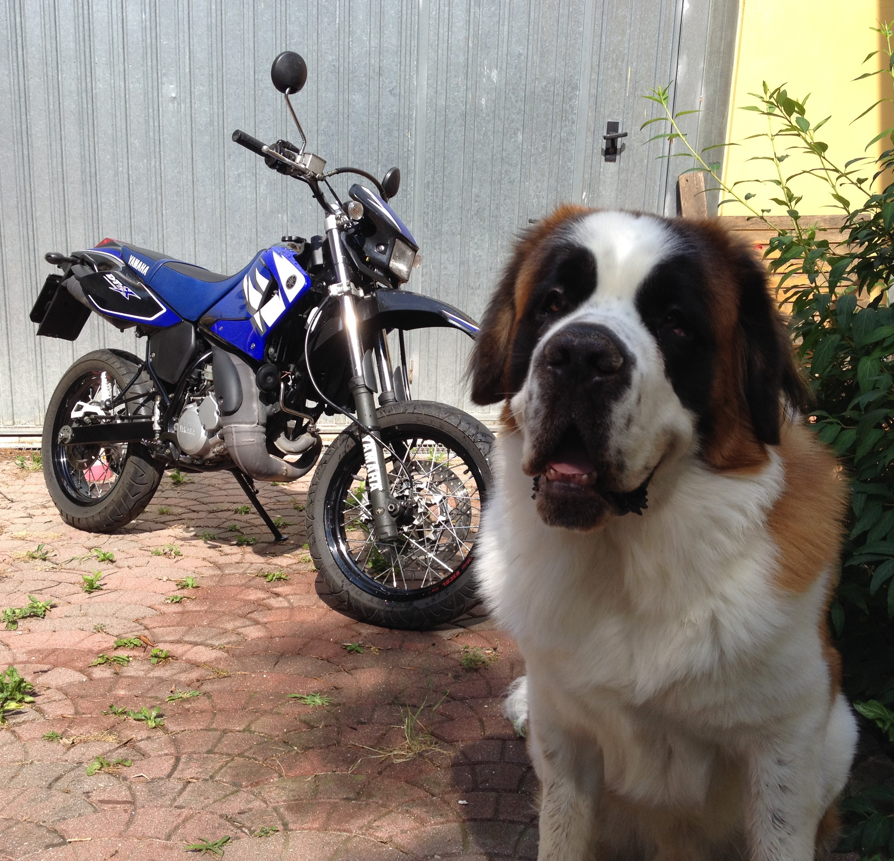
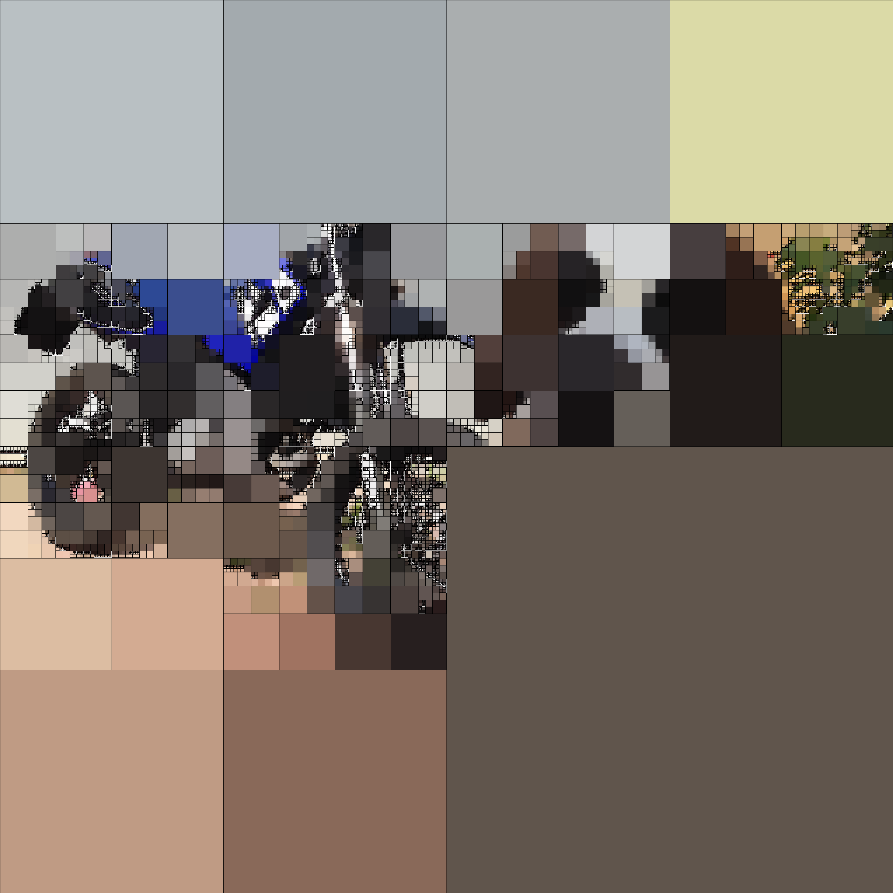
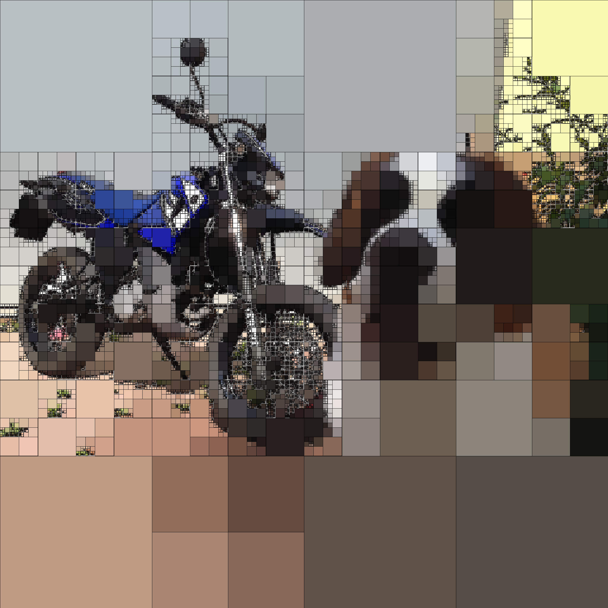
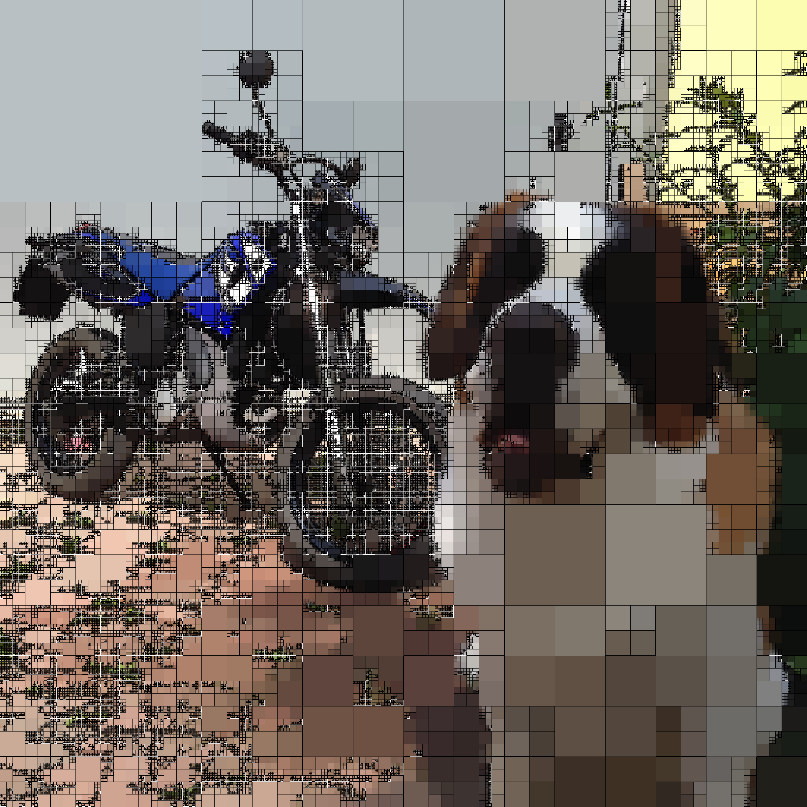

# ImageQuadApprox

Approximate images using quadtree i.e. by recursively subdividing the image into four quadrants if some conditions are met. In this case, the split is done whether the image and its mean colour differ in some tolerance.
# How to run

1. Install the requirements: ```pip3 install -r requirements.txt```

2. Run the code: ```python3 main.py <input_image> -e <threshold> -o <outpput_image>``` <br/>
Example ```python3 main.py test.jpeg -e 35 -o result.png``` and the result for different threshold epsilon. <br/>


<p float="middle">
  
  
  <br>
  
  
</p>

You can set the threshold with the flag *--epsilon*. Other flags are available and listed by running ```python3 main.py --help```.

# References
1. https://estebanhufstedler.com/2020/05/05/image-quadrangulation/
2. https://ieeexplore.ieee.org/document/544569
