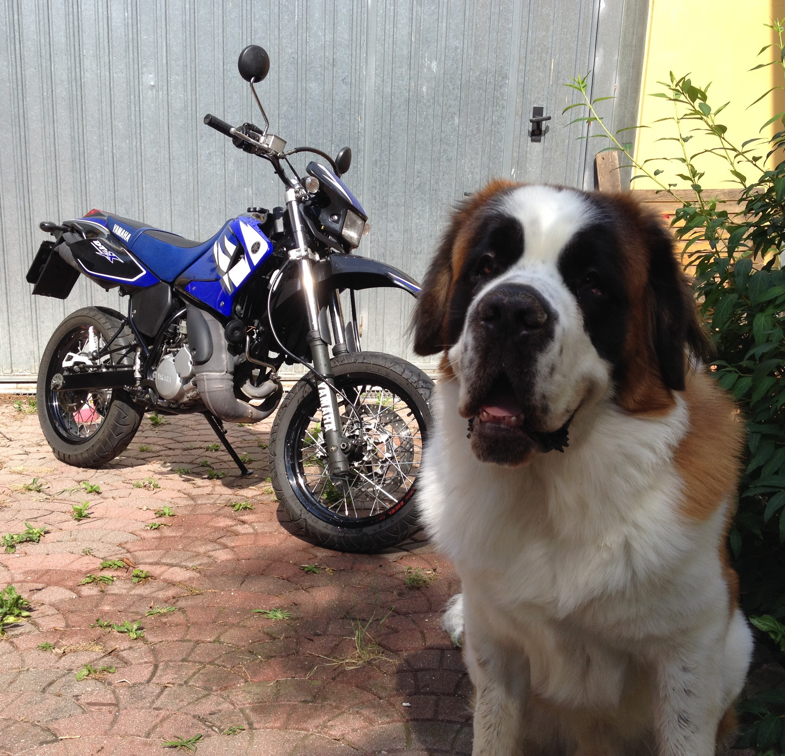
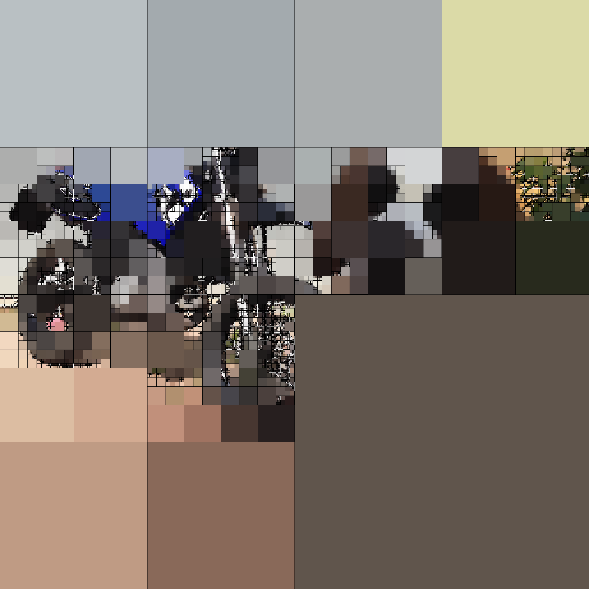
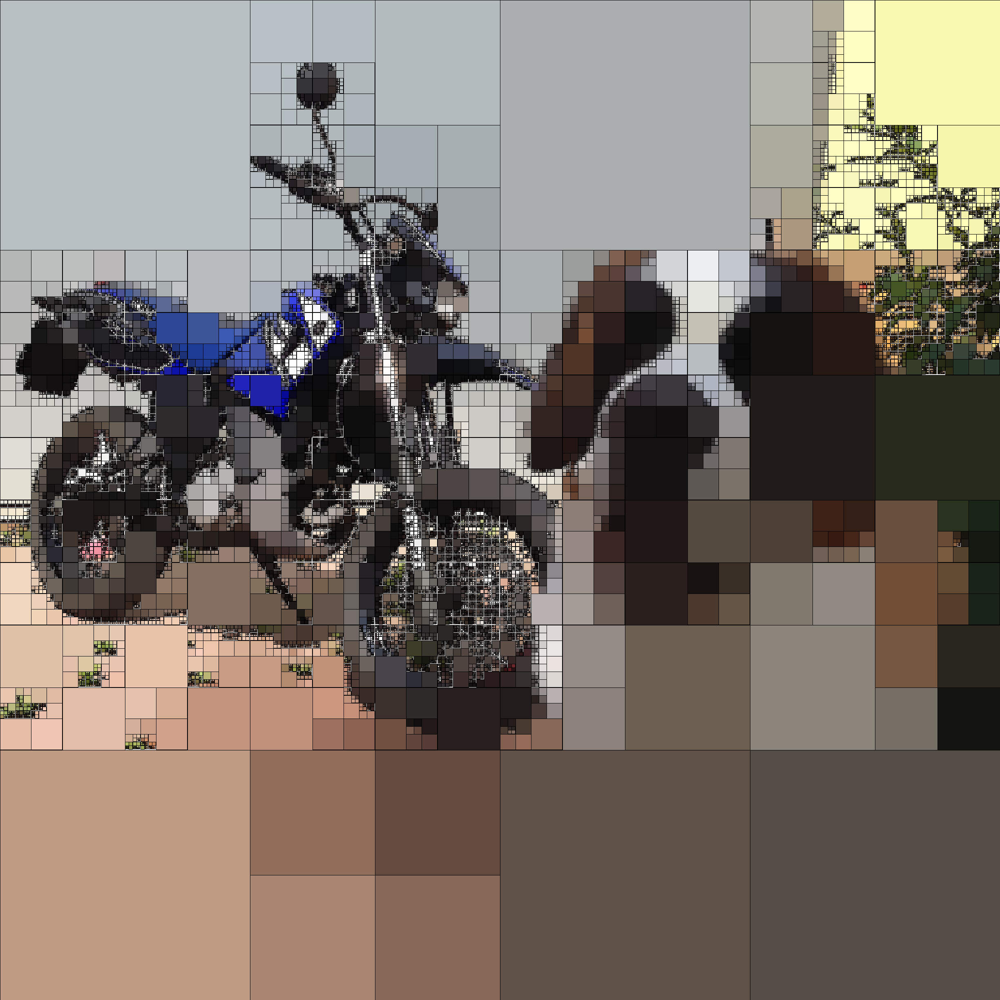
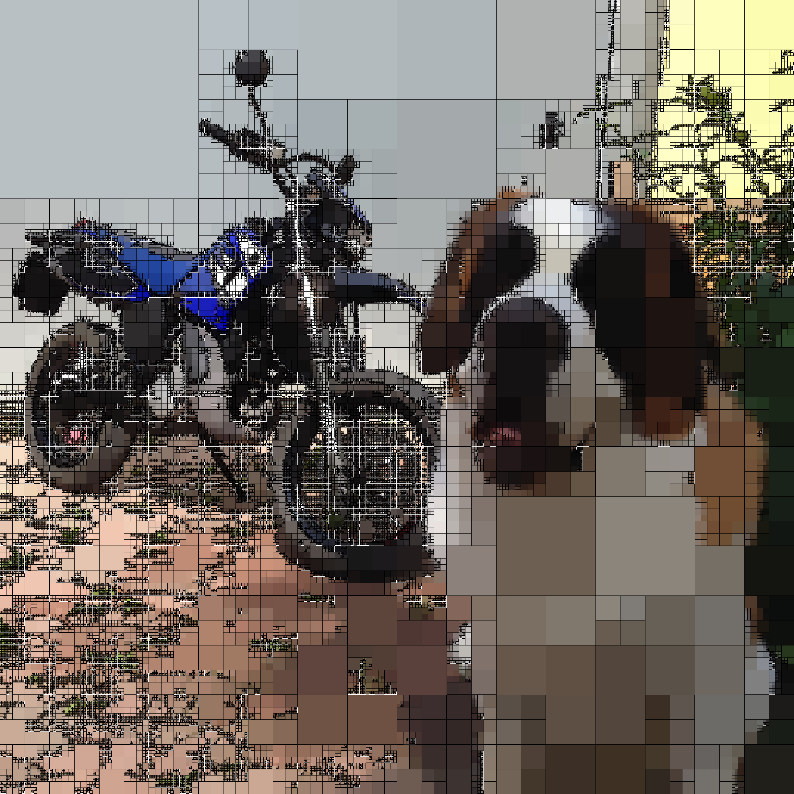

# ImageQuadApprox

Approximate images using quadtree i.e. by recursively subdividing the image into four quadrants if some conditions are met. In this case, the split is done whether the image and its mean colour differ in some tolerance. This is not an efficient way of approximating images however the visual result is pleasant to the eye.

# How to run

1. Install the requirements: ```pip3 install -r requirements.txt```

2. Run the code: ```python3 main.py <input_image> -e <threshold> -o <outpput_image>``` <br/>
Example ```python3 main.py test.jpeg -e 35 -o result.png``` and the result for different threshold epsilon. <br/>


<p float="middle">
  
  
  <br>
  
  
</p>

Other parameters are listed by running ```python3 main.py --help```.

# TODO
I'm interested into implementing other quadtree methods such as:

- [ ] Allow non-square quadrants
- [ ] Optimise the split of the quadtree (i.e. split quadrants such that the error in the color is minimised)
- [ ] Animation! Animate the quadtree recursive subidivision
# References
1. https://estebanhufstedler.com/2020/05/05/image-quadrangulation/
2. https://ieeexplore.ieee.org/document/544569
